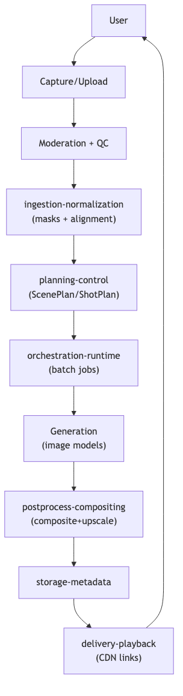

# Personastu integration notes

## Minimal service set
- Upload/Capture API + client editor UI
- Moderation + QC + ingestion-normalization
- Planner (ScenePlan/ShotPlan)
- Generation + compositing workers
- Postprocess pipeline (upscale/restore/grade)
- Storage/Metadata + CDN delivery
- Observability/Cost

## Reusable SDK components involved
- persona-core, scene-system, ingestion-normalization, planning-control, orchestration-runtime,
  postprocess-compositing, moderation-policy, storage-metadata, delivery-playback, observability-cost.

## Pipeline
Source: `diagrams/personastu_end_to_end.mmd`

