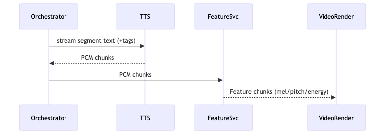

# audio-speech — Tech Spec

## Reference implementation (Python)
The reference implementation lives under `packages/audio-speech/python/` and exposes:

- `PcmChunk`, `AudioFeatureChunk` dataclasses for PCM + feature windows.
- `generate_tts_chunks(...)` — ai-kit TTS wrapper that emits PCM chunks (or empty on missing kit/config).
- `generate_silence_chunks(...)` — deterministic fallback for offline runs.
- `extract_audio_features(...)`, `trim_pcm_chunks(...)`, `write_wav_file(...)` — feature + I/O helpers.

## 1) Streaming TTS
Interface:
- `StartTTS(request) -> stream<PCMChunk>`
- supports per-segment tags (emotion, pacing, laughs/whispers where available)

Provider implementations:
- OpenAI `gpt-4o-mini-tts` (streaming)
- ElevenLabs v3 (audio tags)

Local implementations:
- Coqui XTTS-v2 (voice cloning) for high flexibility
- Piper for lightweight fast voices

## 2) VAD (barge-in)
- Use Silero VAD on client or server:
  - detect user speech start
  - trigger cancelation of current assistant turn

## 3) Audio feature extraction (streaming)
Input: PCM 16k/24k (standardize early)  
Output: sliding windows (e.g., 20–40ms hop)
- mel-spectrogram (80–128 bins)
- pitch + energy contours
- optional phoneme/viseme timing (backend dependent; see `viseme-aligner`)

Packetization:
- `AudioFeatureChunk { t0, t1, mel, pitch, energy }`

## 4) Optional ASR
Provider:
- OpenAI `gpt-4o-mini-transcribe` (supports realtime incremental deltas)
Local:
- Whisper / faster-whisper

## Mermaid diagram
See `diagrams/audio_streaming.mmd`.

