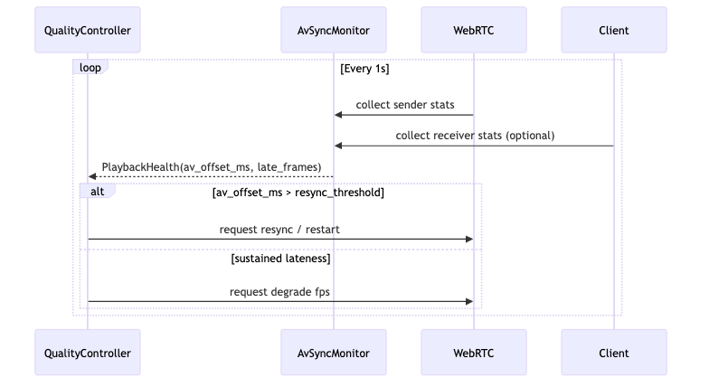

# av-sync — Tech Spec

## Architecture
`av-sync` sits at the transport boundary:

- **Local pipeline**: `render_worker -> encoder -> av-sync -> WebRTC sender`
- **Provider bridge**: `provider WebRTC -> (optional decode/encode) -> av-sync monitor -> client WebRTC`

## Core abstractions

### 1) Master clock
Use a monotonic clock (`CLOCK_MONOTONIC` / `performance.now()`-style) as the source of truth.

- `t0 = clock.now()` at stream start
- Maintain separate counters for:
  - audio samples sent
  - video frames sent

### 2) Timestamp domains
WebRTC/RTP commonly uses:
- audio RTP timestamp rate = sample rate (e.g., 48,000)
- video RTP timestamp rate = 90,000

Define:
- `audio_ts = audio_samples_sent`
- `video_ts = round(elapsed_sec * 90000)` OR `frame_index * (90000/fps)` if fps is stable

Prefer **audio-master**:
- video PTS is derived from audio timeline (to keep mouth aligned to audio)
- if video frames arrive late, apply late-frame policy

## Policies

### A) Buffering policy
Config knobs (defaults are conservative):
- `target_jitter_buffer_ms`: 60–120ms
- `max_jitter_buffer_ms`: 250ms
- `resync_threshold_ms`: 120ms (if observed A/V offset exceeds, trigger resync)

### B) Late frame policy
`late_frame_policy`:
- `DROP` (default for realtime)
- `REPEAT_LAST` (useful for tiny stalls; may look like frozen face)
- `DEGRADE_FPS` (lower fps to match compute)
- `TIME_STRETCH_AUDIO` (avoid unless you have a high-quality audio stretcher)

Recommended for FT-Gen:
- `DROP` + degrade fps under sustained lateness.

### C) Provider bridge policy
When bridging a provider stream:
- you may not control provider PTS
- still compute observed A/V offset and emit metrics
- optionally re-encode into your own WebRTC session with your own PTS (higher cost)

## A/V offset estimation
At the sender:
- estimate offset as `video_pts_time - audio_pts_time`

At the client (best):
- use WebRTC stats / RTCP reports:
  - audio jitter buffer delay
  - video jitter buffer delay
  - frame decode timestamps

The monitor emits:
- `av_offset_ms`
- `audio_buffer_ms`, `video_buffer_ms`
- `video_late_frames`, `audio_underruns`

## Integration with Quality Controller
`av-sync` emits:
- `PlaybackHealth` signals (offset, late frames)
Quality controller can respond by:
- requesting a stream restart (provider)
- reducing fps/resolution (local)
- shortening the remaining turn budget

## Pseudocode

```ts
// audio-master timestamping
audio_samples_sent += pcm.length
audio_pts = audio_samples_sent

// video pts derived from audio timeline
elapsed_audio_sec = audio_samples_sent / sample_rate
video_pts = round(elapsed_audio_sec * 90000)

// if frame is late beyond threshold -> apply policy
if (now - expected_send_time_ms > late_threshold_ms) {
  drop_or_repeat_or_degrade()
}
```

## Deployment notes
- Local encode: run with encoder worker; keep clock state per WebRTC track
- Provider bridge: monitor can run centrally; sampling frames for scoring is optional

## Testing
- simulate jitter (packet delay/loss) and ensure A/V offset remains bounded
- verify monotonic PTS under cancel/restart
- verify resync behavior (restart stream, reset clock) does not cause negative PTS

## Mermaid diagram
Source: `diagrams/av_sync_monitor.mmd`


