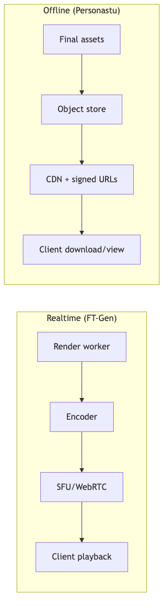

# delivery-playback — Tech Spec

## Reference implementation (Python)
The reference implementation lives under `packages/delivery-playback/python/` and exposes:

- `MediaStreamController`, `QueueAudioTrack`, `QueueVideoTrack` for aiortc-backed streaming.
- `stream_audio_video(...)`, `stream_pcm_chunks(...)`, `stream_video_file(...)` utilities.
- `build_solid_frame(...)`, `build_image_frame(...)`, `load_image_planes(...)` frame helpers.

## FT-Gen (WebRTC)
Recommended architecture:
- Client establishes WebRTC connection to SFU (e.g., LiveKit)
- Gateway handles auth + signaling + sticky routing to render worker
- Render worker encodes frames (H.264/AV1) + audio (Opus) and publishes tracks
- Use `av-sync` for monotonic timestamps, buffering policy, and playback health metrics (A/V offset, late frames)

Features:
- barge-in (cancel current turn)
- quality adaptation (fps/res/bitrate) under load
- “thinking/listening” loop track while generating

## Personastu (CDN)
- Store final assets in object storage
- Provide signed URLs via API
- Front with CDN (Cloudflare/Akamai/Fastly) for low latency

## Encoding profiles
- Video: 720p/1080p ladders; maintain consistent fps targets
- Audio: Opus 24–48k depending on client

## Mermaid diagram
See `diagrams/delivery_paths.mmd`.

