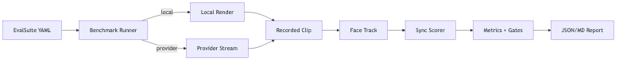

# eval-lipsync-benchmark — Tech Spec

## Suite structure

### EvalCase
- `case_id`
- `persona_ref` (or test anchor)
- `text`
- `language`
- `tts_backend` + voice id
- `render_backend` (local/provider)
- `expected_duration_sec` (optional)
- `network_profile` (optional)

### EvalSuite
- list of EvalCase
- global policy thresholds:
  - lip_warn, lip_fail
  - allowed fail rate

## Execution modes

### A) Local pipeline mode
1) generate audio via TTS
2) render video (local backend)
3) run `face-track` + `sync-scorer` over resulting clip
4) compute metrics

### B) Provider pipeline mode
Two options:
- **Monitor-only**: request provider stream, sample frames, score periodically
- **Relay+record**: bridge stream to file, then score offline (more reliable)

## Network simulation
If you want to measure *experienced* lip sync:
- run through a WebRTC test harness with configurable:
  - jitter
  - packet loss
  - bandwidth caps
- collect WebRTC stats and correlate with score drops

This can be done in a headless browser environment or on-device harness.

## Metrics
Compute per-case:
- `score_mean`, `score_p50`, `score_p95_low` (lower tail)
- `fail_window_rate` (fraction of windows < lip_fail)
- `offset_ms_mean`, `offset_ms_p95_abs`
- `occluded_window_rate` (ignored windows)
- `playback_av_offset_ms_p95` (if available)

Compute suite-level:
- weighted aggregates and worst-case offenders.

## CI gates (example)
- suite fail if:
  - `score_mean` drops by > 0.05 from baseline
  - OR fail_window_rate > 2%
  - OR offset_ms_p95_abs > 120ms

## Outputs
- `reports/<run_id>/summary.md`
- `reports/<run_id>/report.json`
- `reports/<run_id>/worst_cases/` clips + plots

## Tooling
Implementation can be a Python CLI:
- loads suite YAML
- executes cases (calling your orchestrator via API)
- runs scorers
- saves reports

## Reproducibility
- store:
  - model versions
  - seeds
  - backend configs
  - git SHA
so regressions can be bisected.

## Mermaid diagram
Source: `diagrams/eval_flow.mmd`

