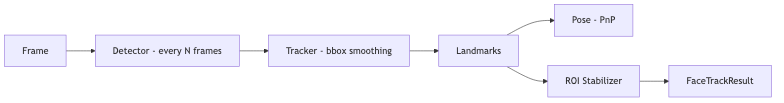

# face-track — Tech Spec

## Pipeline

1) **Detect**
- Run face detector (every N frames, e.g. N=5) to reacquire.
- Use camera-mode constraints as priors (expected face region).

2) **Track**
- Between detections, track face bbox using:
  - optical flow (KLT) OR
  - correlation tracker OR
  - Kalman filter over bbox center/size

3) **Landmarks**
- Run landmark model on the cropped face region.
- Smooth landmarks temporally:
  - exponential moving average (EMA) per landmark
  - reject outliers with median filter

4) **Pose**
- Estimate head pose via PnP using a canonical 3D face landmark template.

5) **ROI stabilization**
- Compute mouth ROI from mouth landmarks.
- Produce a transform that keeps mouth centered and scale-stable:
  - `crop_rect` in source frame
  - `affine_transform` to normalized ROI space
- Provide both:
  - `face_roi` (for drift monitor, identity embed extraction)
  - `mouth_roi` (for sync scoring + mouth correction)

## Data model

### FaceTrackResult
- `frame_id`, `timestamp_ms`
- `faces[]` (usually 0 or 1 in selfie modes)
  - `track_id`
  - `bbox_xywh` (smoothed)
  - `landmarks_2d[]` (normalized or pixel)
  - `pose_yaw_pitch_roll`
  - `mouth_roi` (rect + affine)
  - `face_roi` (rect + affine)
  - `confidence`
  - `occlusion_flags` (e.g., mouth_occluded)

## Backend interface
Implement `FaceTrackBackend` with two calls:

- `init(frame, hint?) -> TrackState`
- `update(frame, state, hint?) -> (FaceTrackResult, state)`

Where `hint` may include:
- expected face region
- camera mode
- last known bbox

## Performance targets
- CPU-only: < 8ms/frame at 512px short side (with detection every 5 frames)
- GPU: < 2ms/frame

## Integration points

### With local render worker
- run per-block (e.g., once every 8–16 frames)
- output ROI for scoring/correction on that block

### With provider bridge
- sample 1–2 frames per second for monitoring
- optionally run more frequently if lip sync issues are common

## Testing
- synthetic occlusion tests (masking lower face)
- head pose sweep within allowed max pose rate
- mirror selfie mode with phone rectangle occluding face side

## Mermaid diagram
Source: `diagrams/face_track_flow.mmd`

