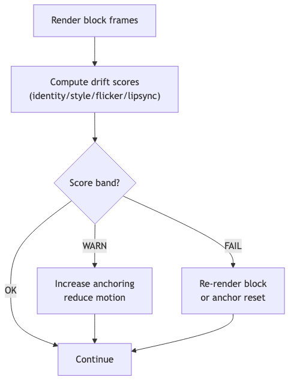

# identity-drift — Tech Spec

## Metrics (recommended baseline)
1. **Identity similarity**
   - Extract face embedding from sampled frames
   - Compare vs PersonaPack face embeddings (cosine similarity)
   - Model: InsightFace embeddings (ArcFace family)

2. **Background/style similarity**
   - Crop background region (or mask subject out)
   - Compute image embedding (OpenCLIP)
   - Compare vs reference background embeddings per persona/stage

3. **Temporal flicker**
   - frame-to-frame difference metrics (SSIM/LPIPS) on background region
   - optionally track frequency-domain noise for “diffusion shimmer”

4. **Lip-sync confidence**
   - Use `sync-scorer` (SyncNet-style) to compute lip-sync score + estimated A/V offset (sampled windows/blocks)
   - Feed `LipSyncSignal` to `quality-controller` alongside drift + playback health to choose safe actions

## Control loop (FT-Gen)
- Runs per render block (e.g., 8–16 frames)
- If FAIL, route signals through `quality-controller` (or apply a local policy):
  - re-render last block with stronger anchor injection
  - reduce motion controls temporarily
  - force sink/anchor refresh (if backend supports)

## Thresholding strategy
- per-persona calibration: store p50/p90 drift stats during QA
- operate with bands:
  - OK: no action
  - WARN: increase anchor injection frequency
  - FAIL: rerender block / reset to canonical anchor

## Interfaces
- `ScoreFrame(frame, masks, refs) -> DriftSignal`
- `RecommendAction(drift_signal, trend, policy) -> Action` (optional; otherwise send signals to `quality-controller`)

## Mermaid diagram
See `diagrams/drift_control_loop.mmd`.

