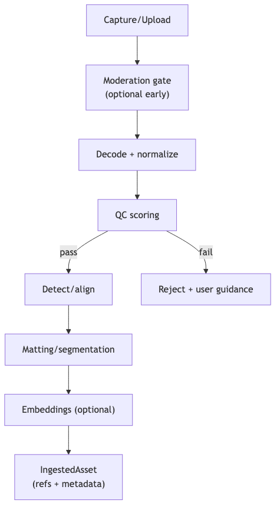

# ingestion-normalization — Tech Spec

## Core pipeline stages
1. **File normalization**
   - decode to RGB, fix orientation, standardize color space
2. **Quality checks (QC)**
   - resolution thresholds
   - blur/low-light heuristics
   - face count (0/1/2+)
   - occlusion score (hands/phone)
3. **Detection & alignment**
   - face bbox + landmarks
   - head pose estimates
   - optional body/upper-body keypoints (for framing)
4. **Segmentation / matting**
   - Image matting: MODNet (trimap-free portrait matting)
   - Video matting: RVM (temporal memory; robust to motion)
   - High-quality promptable segmentation: SAM 2 (image/video)
5. **Embeddings (optional at ingest)**
   - face embeddings (identity): InsightFace
   - style embeddings (for scene matching): OpenCLIP
   - store embeddings as refs
6. **Provenance + consent**
   - require user attestation (“I own/created/consent”)
   - optional “self-only” verification mode: link uploads to account via liveness/face match (policy decision)

## Output contract: IngestedAsset
Recommended fields:
- `raw_asset_ref`
- `normalized_image_ref` / `normalized_video_ref`
- `primary_face`: bbox + landmarks + pose
- `alpha_ref` (matte) + `segmentation_ref` (mask)
- `quality_report` (scores + failures)
- `provenance` (user attestation + timestamps)

## Deployment
- CPU-friendly stages first (decode, QC, face count)
- GPU pool for matting/segmentation when needed
- Make each stage idempotent; cache by content hash

## Mermaid diagram
Source: `diagrams/ingestion_pipeline.mmd`

