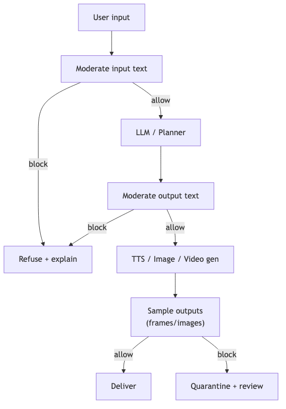

# moderation-policy — Tech Spec

## Enforcement points (recommended)
1. **User text** (pre-LLM)
2. **Assistant text** (pre-TTS/video/image)
3. **User images/videos** (ingestion)
4. **Sampled frames** from generated video (post-gen, defense-in-depth)

## Provider option (recommended baseline)
- OpenAI `omni-moderation-latest` supports text + image moderation in one API.

## Local option (best-effort)
- Text: Llama Guard classifier (fast)
- Images: dedicated image safety classifier (varies); or provider fallback for higher accuracy

## Policy packs
Represent policy as a composable config:
- `illegal_only` (default)
- `allow_nsfw_adult` (optional)
- `no_real_people` / `self_only_real_person` (policy decision)
- `no_hate` / `no_harassment` (optional)

## Prompt injection & abuse guardrails
- Detect tool/policy override attempts in user input
- Strip/escape untrusted tool instructions
- Keep “system constraints” out of user-controllable fields

## Audit log schema
- request id, session/job id
- inputs (hashed refs), model/provider versions
- decision (allow/block), categories, confidence
- reviewer override fields (optional)

## Mermaid diagram
Source: `diagrams/moderation_gates.mmd`

