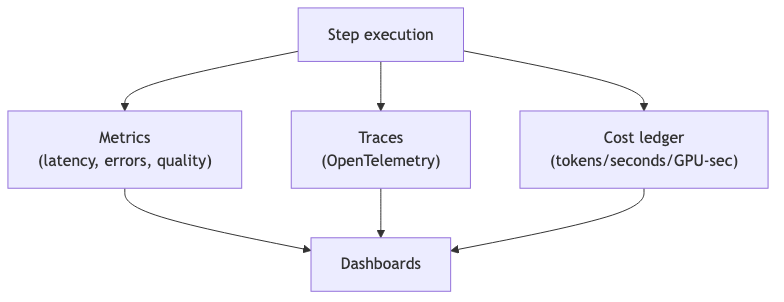

# observability-cost — Tech Spec

## Telemetry primitives
- Trace per `GenJob` and per step
- Structured logs with `job_id`, `session_id`, `persona_id`, `provider`
- Metrics:
  - p50/p95 latency per step
  - GPU utilization per pool
  - drift metrics over time
  - cancelation rate (barge-in)

## Cost attribution
Record per step:
- provider/model
- input/output tokens (LLM/TTS) or seconds (video)
- GPU-seconds (local)
- retries and wasted compute
Store as append-only ledger.

## Health + fallback
- periodic synthetic probes per provider/backend
- circuit breaker when error rate spikes
- fallback rules:
  - switch TTS provider
  - switch video backend tier
  - shorten default target duration under load

## Mermaid diagram
Source: `diagrams/telemetry_cost_flow.mmd`

