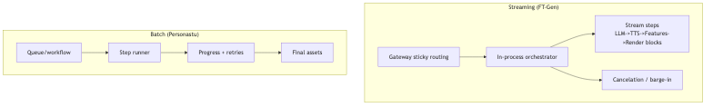

# orchestration-runtime — Tech Spec

## Concepts
- **GenJob**: a DAG execution instance (streaming turn or batch run)
- **Step**: idempotent unit of work (LLM, TTS, matting, render block, upscale, etc.)
- **Worker Pool**:
  - CPU pool (QC, metadata, lightweight transforms)
  - GPU pools (image/video models, matting, render)

## Streaming mode (FT-Gen)
- Session Gateway routes `(session_id)` to a **sticky render worker**
- Orchestrator runs an in-process event loop:
  - subscribes to client interrupts (cancel)
  - streams tokens/segments to TTS
  - streams audio features to video render
  - emits frames immediately to encoder/WebRTC

State:
- `SessionState` stored in Redis + local warm cache
- “context caches” stored in worker-local memory with periodic checkpointing

## Batch mode (Personastu)
Two implementation options:
1. Use a workflow engine (Temporal / Dagster / Prefect) for retries + observability
2. Use a job queue (Redis + BullMQ/Celery) with explicit step records

Recommended hybrid:
- Workflow engine for long-running batches
- Lightweight in-process orchestration for low-latency streaming

## Step interface (pseudo)
- `Step.run(input_refs, params) -> output_refs + metrics`
- Must be idempotent; cacheable by `(inputs_hash, params_hash, model_snapshot)`

## Retry policy
- classify errors: transient (retry) vs deterministic (fail-fast)
- exponential backoff with jitter
- limit retries per step; surface “best effort partial outputs” when safe

## Mermaid diagram
Source: `diagrams/orchestration_modes.mmd`

