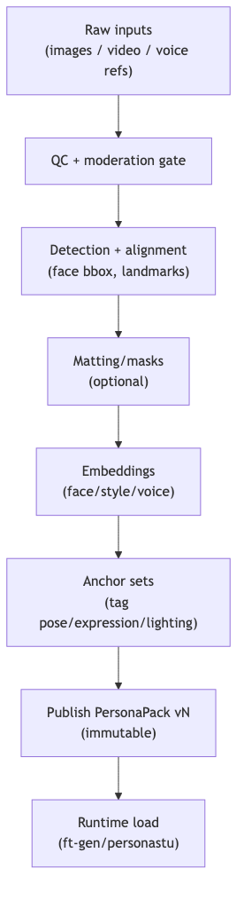

# persona-core — Tech Spec

## Key APIs
### 1) Persona Registry Service (HTTP/gRPC)
- `CreatePersona(persona_id, metadata)`
- `CreatePersonaVersion(persona_id, inputs) -> version`
- `GetPersonaPack(persona_id, version) -> PersonaPack`
- `ListPersonaVersions(persona_id)`
- `ResolveAsset(ref) -> signed URL / bytes`

### 2) Persona Builder Pipeline (batch jobs)
Input: images/video clips + optional voice refs  
Output: PersonaPack + derived artifacts (masks, embeddings, canonical crops)

Steps (suggested):
1. **QC**: resolution, blur, occlusion, face count, lighting tag
2. **Detection/alignment**: face bbox + landmarks + canonical crop
3. **Matting/masks**: optional head/shoulders mask per anchor
4. **Embedding extraction**
   - Face embedding (identity): InsightFace (ArcFace) toolbox
   - Style embedding: OpenCLIP (image embedding) + simple lighting classifier
   - Voice embedding (local option): SpeechBrain ECAPA-TDNN or Resemblyzer
5. **Anchor set construction**
   - group by camera mode
   - tag by expression / pose / lighting
6. **Persist**
   - store assets in object storage
   - store metadata + refs in Postgres

## Data model (high level)
See `schemas/persona_pack.schema.json`.

### Asset refs
Store heavyweight blobs outside the DB:
- `image_ref`, `mask_ref`, `embedding_ref` point to object storage keys (S3/MinIO/GCS).

## Runtime hooks
- `SelectAnchor(mode, desired_emotion, continuity, drift_stats) -> image_ref`
- `AnchorRefreshPolicy(turn_index, drift_trend) -> force_reset?`
- `BehaviorPolicyClamp(actor_timeline) -> clamped_timeline`

## Recommended model choices
- Face detection/alignment + embeddings: **InsightFace** (local)
- Video/image matting (optional): **MODNet** (image), **RVM** (video)
- Speaker embeddings: **SpeechBrain ECAPA-TDNN** or **Resemblyzer**
- NOTE on “face swap” weights: some common swap models have restrictive commercial licensing; treat as optional plugin requiring explicit rights.

## Performance targets
- PersonaPack load: <50ms (warm) from local cache
- Anchor selection: <5ms
- Builder pipeline: async batch; minutes per persona depending on QA

## Failure modes
- Too few usable anchors per mode → block publish or require recapture
- Embedding instability across anchors → warn (identity drift risk)
- Missing voice/behavior config → use safe defaults

## Mermaid diagram
Source: `diagrams/persona_pack_lifecycle.mmd`

