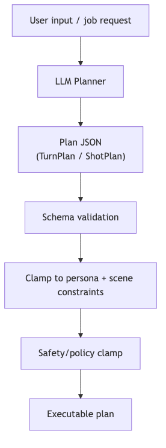

# planning-control — Tech Spec

## TurnPlan contract (FT-Gen)
Required:
- `speech_budget_sec_target`
- `speech_budget_sec_hardcap` (30)
- `speech_segments[]`: ordered by priority (stop safely between segments)
- `actor_timeline[]`: emotion + gaze + listening/speaking transitions
- `camera_mode_suggestion` (validated downstream)

### Budgeting algorithm (suggested)
- Estimate seconds from text tokens/words (language-dependent), then:
  - default target: 6–10s
  - min: 4s (unless ultra-short reply)
  - hard cap: 30s
- Stream segments until `current_audio_duration >= hardcap - tail_buffer`
- Never cut mid-segment unless user barges in.

## ScenePlan / ShotPlan contract (Personastu)
- `shots[]`: each has prompt recipe, seed, composition constraints, required masks
- `scene_preset_id` + overrides
- `deliverables`: aspect, resolution, export profile

## Model/provider options
Provider:
- OpenAI **GPT-5.2 / GPT-5 mini** using Structured Outputs for JSON
Local:
- OpenAI **gpt-oss-120b** (open-weight; harmony format) or Meta **Llama 4** variants

## Plan validation pipeline
1. JSON schema validation
2. Clamp to persona behavior policy (emotion bounds, banned topics)
3. Clamp to scene/camera constraints
4. Clamp to safety constraints (no policy-violating instructions)

## Mermaid diagram
Source: `diagrams/planning_contracts.mmd`

