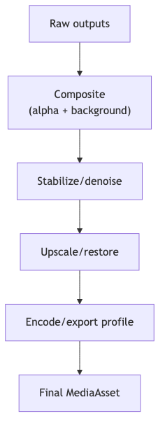

# postprocess-compositing — Tech Spec

## Background replacement
Inputs:
- subject image/video
- alpha matte (from ingestion)
- background image/video (from scene-system)
Steps:
1. edge refinement (feather + dehalo)
2. color match (histogram/mean-std in Lab)
3. shadow/ambient occlusion (optional heuristic)
4. composite (alpha blend)
5. final grade (contrast/saturation curves)

## Relighting (optional)
- Estimate lighting direction from subject (heuristic) and apply gentle relight or generate background with matching light prompts.

## Upscale / restoration
- Real-ESRGAN for general upscaling/denoise
- CodeFormer for face restoration (careful: can change identity if overused)

## Lip-sync correction (optional)
- MuseTalk (real-time quality lip sync) or Wav2Lip baseline
- Trigger only when lip-sync confidence drops (from `sync-scorer` / `quality-controller`)

## Export profiles
- Images: PNG (edits), JPEG (feed)
- Video: H.264/AV1 encode ladders; Opus audio
- Store exact encode params in MediaAsset metadata.

## Mermaid diagram
See `diagrams/postprocess_stack.mmd`.

