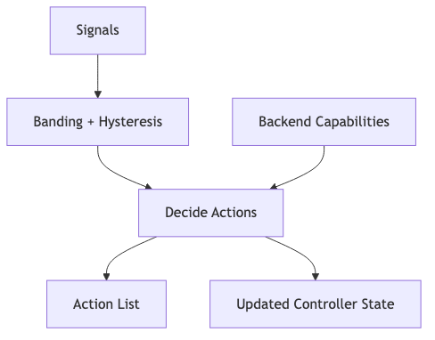

# quality-controller — Tech Spec

## Core concepts

### Capability-driven actions
Every render backend provides a `BackendCapabilities` object so the controller never requests
an impossible action.

Examples:

**Local backend**
- `supports_rerender_block = true`
- `supports_anchor_reset = true`
- `supports_mouth_corrector = true`
- `supports_param_update = true`

**Provider backend**
- `supports_rerender_block = false`
- `supports_anchor_reset = false`
- `supports_restart_stream = true`
- `supports_failover = true`

### Policy bands + hysteresis
Use a 3-band approach for each metric:
- OK
- WARN
- FAIL

And add hysteresis:
- require N consecutive FAIL windows before triggering heavy action
- require M consecutive OK windows before returning to NORMAL

## Signals

### LipSyncSignal
- `score` in [0,1]
- `offset_ms` (audio leads if positive by convention)
- `confidence` in [0,1]
- `occluded` boolean
- `is_silence` boolean

### DriftSignal
- `identity_similarity` in [0,1]
- `bg_similarity` in [0,1]
- `flicker_score` in [0,1] (higher worse)
- `pose_jitter` (deg/sec)

### PlaybackHealth (optional but recommended)
- `av_offset_ms`
- `late_video_frames_per_s`
- `jitter_buffer_ms`

### SystemHealth
- `render_fps`
- `gpu_util`
- `queue_depth`
- `p99_block_latency_ms`

## Actions
Represent actions as an ordered list (highest priority first), e.g.:

- `RERENDER_BLOCK(strengthen_anchor=true)`
- `APPLY_MOUTH_CORRECTOR(window=last_block)`
- `REDUCE_FPS(target=24)`
- `SHORTEN_REMAINING_TURN(target_sec=6)`
- `RESTART_PROVIDER_STREAM()`
- `FAILOVER_BACKEND(target="provider_b")`
- `FALLBACK_OFFLINE_CLIP()`

## Decision algorithm (recommended)

1) **Ignore invalid windows**
- if silence or mouth occluded -> don’t trigger lip-sync fixes from that window.

2) **If playback A/V offset is bad**
- prioritize `av-sync` resync / restart before rerendering (because model lip sync may be fine).

3) **If lip-sync FAIL**
- local:
  - try mouth corrector (fast, local) if available
  - else rerender last block with stronger anchor
- provider:
  - restart stream if repeated FAIL
  - failover if restart fails

4) **If identity/style drift FAIL**
- local: anchor reset / sink refresh
- provider: restart or failover

5) **If system health degraded**
- reduce fps/res, reduce motion, shorten remaining turn.

## Default thresholds (starting point)
These need tuning per backend.

- `lip_warn = 0.55`
- `lip_fail = 0.45`
- `lip_fail_consecutive = 3`
- `drift_warn_identity = 0.80`
- `drift_fail_identity = 0.72`
- `av_offset_warn_ms = 80`
- `av_offset_fail_ms = 140`

## State
Maintain per-session controller state:
- recent rolling window of scores
- current “degrade level” (0..3)
- last heavy action timestamp (cooldown)

## Service interface
Expose a small service or library function:

- `decide(signals, caps, ctx, state) -> (actions, new_state)`

## Testing
- simulate:
  - lip-sync score drops (inject misalignment)
  - drift increases
  - network jitter increases
- verify:
  - correct action ordering
  - no oscillation (hysteresis works)

## Mermaid diagram
Source: `diagrams/quality_controller_flow.mmd`

