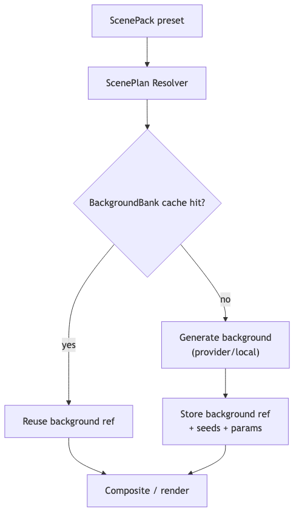

# scene-system — Tech Spec

## Data artifacts
- `ScenePack` (versioned presets)
- `ScenePlan` (resolved params for one output)
- Optional `BackgroundBank` (cached reference images, per preset)

See `schemas/scene_pack.schema.json`.

## ScenePack structure (recommended)
- `scene_pack_id`, `version`
- `presets[]`:
  - semantic tags (location, era, vibe)
  - parameter defaults (time_of_day, lens, palette)
  - prompt recipe template (positive + negative)
  - optional reference images (for stability)
  - constraints (camera, FOV, allowed props)

## Model choices for background generation
Provider options:
- OpenAI **gpt-image-1 / gpt-image-1.5** for high-quality image generation + edits
- Stability “Stable Image Ultra” API for T2I / I2I flows

Local options:
- SDXL (base + inpainting) + ControlNet for structure
- IP-Adapter for style control; InstantID/IP-Adapter FaceID if identity conditioning is needed

## Implementation sketch
### 1) ScenePlan Resolver
Inputs:
- persona stage constraints (from PersonaPack)
- app mode (FT-Gen fixed stage vs Personastu preset)
- user prompt or preset id

Outputs:
- `ScenePlan`:
  - resolved prompt(s)
  - seed(s)
  - model/provider selection
  - structural controls (depth/pose if used)
  - output size + aspect + safety tags

### 2) Background generation pipeline
- Check `BackgroundBank` cache:
  - If exists and valid -> reuse
  - Else generate new background + store
- For replacement:
  - ensure subject matting alpha is available (from ingestion)
  - generate background matching lighting direction (optional relight step)
  - composite subject onto background

## FT-Gen enforcement knobs
- background deviation score threshold (from identity-drift)
- lock props to small list
- lock camera modes/FOV/head region

## Mermaid diagram
Source: `diagrams/scene_generation.mmd`

