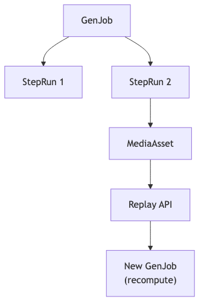

# storage-metadata — Tech Spec

## Storage split
- **Object store** (S3/MinIO/GCS/R2): blobs (images/video/audio/masks/embeddings)
- **Relational DB** (Postgres): metadata and indexes
- **Cache** (Redis): session state, hot indexes, sticky routing

## Core records
### MediaAsset
- `asset_id`, `kind` (image/video/audio/mask/embedding)
- `uri` (object store key)
- `content_hash`, `size`, `dims`, `duration`
- `created_by` (job id / user id)
- `model_snapshot` (provider, model, version)
- `params` (prompts, seeds, control settings)

### GenJob
- `job_id`, `type` (turn / shot / batch)
- `inputs` (refs), `plan` (TurnPlan/ShotPlan)
- `step_runs[]` with timing + retries + logs
- `outputs[]` (MediaAssets)

### SeedRecord
- seed per stochastic step + RNG algorithm identifier

## Reproducibility requirements
To replay an output you need:
- exact model identifier + snapshot (or checksum)
- prompts + negative prompts + control images
- seeds + sampler params
- preprocessing versions (crop, resize, matting)

## APIs
- `PutAsset(blob) -> asset_ref`
- `GetAsset(asset_ref) -> signed url/bytes`
- `CreateJob(job_spec) -> job_id`
- `GetJob(job_id)`
- `ReplayAsset(asset_id) -> job_id`

## Mermaid diagram
Source: `diagrams/asset_lineage.mmd`

