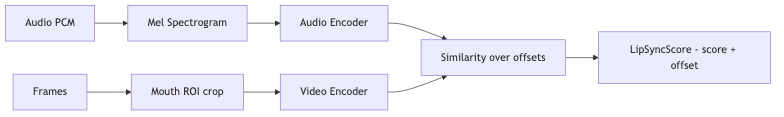

# sync-scorer — Tech Spec

## Core approach: SyncNet-style scoring
1) Convert audio chunk to mel-spectrogram features.
2) Extract mouth ROI sequence (from `face-track`) and normalize resolution.
3) Encode audio and video into embeddings using a pretrained model.
4) Compute similarity over a range of temporal offsets.
5) Choose best offset and map similarity to a score.

## Input windowing
For FT-Gen block-based generation:
- block length: 8–16 frames at 30fps (≈ 0.27–0.53s)
- score can be computed:
  - per block (fast, responsive)
  - or over a sliding window of 0.8–1.2s for stability

Recommended:
- compute a quick per-block score
- compute a slower sliding-window score every ~1s for robustness

## Offset search
Search offsets in a bounded range (configurable):
- default: [-200ms, +200ms]
- step: 20ms (or 1 frame)

Return:
- `offset_ms_best`
- `score_best`
- `score_margin` (best - second best) as confidence proxy

## Handling silence
If RMS energy is below threshold:
- emit `score = null`
- emit `confidence = 0`
- label window as `silence`

Quality controller should ignore silent windows for lip-sync decisions.

## Fallback heuristic scorer
If ML model unavailable:
- compute mouth openness over time from landmarks
- compute audio energy envelope
- compute normalized correlation between the two
- output a low-confidence score

This is mostly for “still better than nothing” monitoring.

## Service interface
Expose a gRPC/HTTP service:

- `ScoreBlock(audio, frames, roi) -> LipSyncScore`
- `ScoreWindow(audio, frames, roi) -> LipSyncScore`

Payload sizes are large; in production pass:
- references to shared memory buffers (in-process) OR
- object-store / shm refs OR
- downsampled frames (e.g., 96x96 mouth ROI)

## Performance targets
- local GPU: < 2ms per block (mouth ROI 96x96, 16 frames)
- CPU: acceptable only for sampled monitoring (provider bridge), not per-frame scoring.

## Integration with quality-controller
Emit `LipSyncSignal`:
- `score`
- `offset_ms`
- `confidence`
- `occluded` (from face-track)
Quality controller chooses actions based on:
- score thresholds
- sustained low score for N blocks
- offset direction (audio leads vs video leads)

## Testing
- unit tests on known aligned vs misaligned clips (synthetic shifts)
- robustness tests for:
  - low light
  - motion blur
  - partial occlusion

## Mermaid diagram
Source: `diagrams/sync_scorer_flow.mmd`

