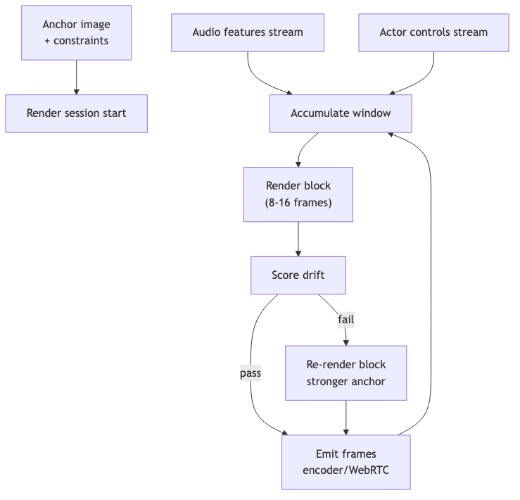

# video-render — Tech Spec

## Reference implementation (Python)
The reference implementation lives under `packages/video-render/python/` and exposes:

- `RenderCapabilities`, `RenderResult` contract types.
- `render_static_video(...)` ffmpeg-backed static image renders for v0.
- `generate_i2v_video_bytes(...)` uses ai-kit video adapters (fal/replicate) returning raw bytes.

## Core contract (backend-neutral)
### Inputs
- `anchor_image_ref` (required; Always-I2V invariant)
- `audio_features_stream` (mel/pitch/energy windows)
- `actor_controls(t)` (emotion/gaze/blink/head hints)
- `mode_constraints` (FOV/head region/jitter limits)
- `context_cache` (optional; backend-specific)

### Outputs
- `frame_stream` (raw frames or encoded chunks)
- `telemetry` (fps, drift stats, cache health)
- updated `context_cache` ref (optional)

## Recommended gRPC API (sketch)
- `StartSession(RenderInit) -> RenderSession`
- `StreamAudioFeatures(session) -> ack`
- `StreamControls(session) -> ack`
- `StreamFrames(session) -> stream<Frame>`
- `EndSession(session)`

## Block loop (FT-Gen)
- fps: 24–30
- block: 8–16 frames (0.27–0.67s)
- optional audio lookahead: 120–240ms

## Backend adapters
### Local pragmatic backend (v0)
- **LivePortrait**: image + driving audio → animated portrait
  - Wrap as “block renderer”: run inference in rolling windows; emit frames as produced.
  - Use anchor re-injection between windows to reduce drift.

### Provider realtime avatar backends (v1)
- HeyGen Streaming API (WebRTC sessions)
- D-ID Agents Streams
- Simli WebRTC client/server
- Tavus CVI / conversation APIs
Adapter strategy:
- Render service becomes a “bridge” translating SDK Render API ↔ provider WebRTC streams.

### Offline fallback (vX)
- OpenAI Sora 2 (`sora-2`, `sora-2-pro`) for 4/8/12s clips with synced audio
- Use for:
  - Personastu short videos
  - FT-Gen degrade path when GPU is unavailable (non-streaming)

## Capability handshake
At session start, the backend should return a `BackendCapabilities` object (see `packages/contracts/types.ts`) so
upstream policy (e.g., `quality-controller`) only requests supported actions.

Minimum recommended fields:
- `supports_rerender_block`, `supports_anchor_reset`, `supports_mouth_corrector`
- `supports_restart_stream`, `supports_param_update`, `provides_webRTC_stream`

Render-specific flags (examples):
- `supports_listening_loop` (silent attentive motion)
- `supports_sink_frames` (reference sink / rolling anchor)
- `supports_context_cache` (temporal KV/cache)
- `supports_mouth_corrector_hook`

## Mermaid diagram
See `diagrams/render_block_loop.mmd`.

